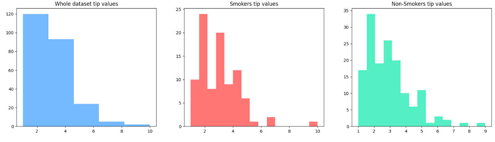
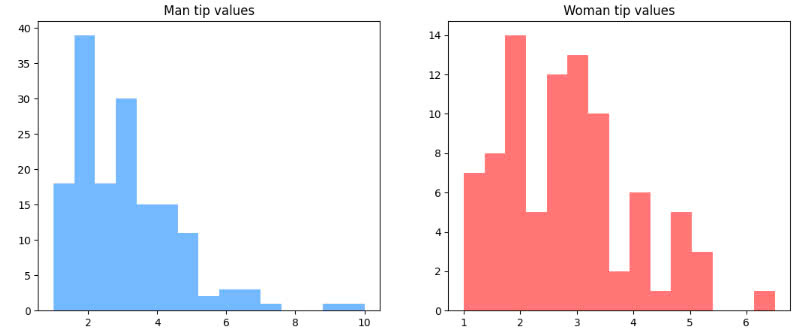
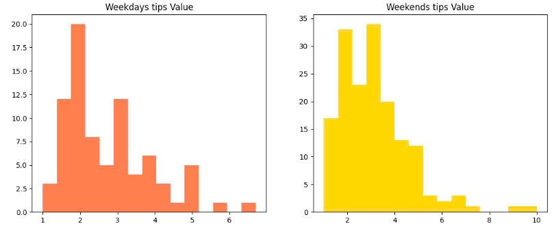
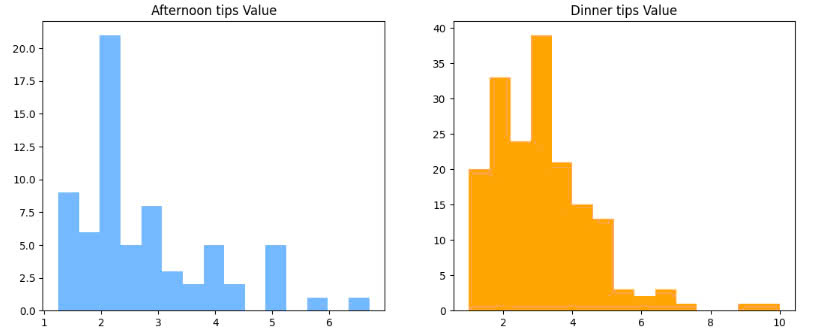

# 🍽️ Restaurant Tips Analysis
## Project description
This project aims to use the restaurant tips dataset to practice creating composition plots and visualizations. We will examine the relationship between different variables and the tips given.
## Source of the data 
The dataset consists of information from 244 restaurant bills, collected in the US in 1987.

It includes details about the tips given to restaurant staff, such as the total bill, tip amount, gender of the person paying, smoking status, day of the week, time of day, and party size.

Then load data from the following link: https://raw.githubusercontent.com/RusAbk/sca_datasets/main/tips.csv
## The main goal
Provide insights by comparing tip amount different dimensional variables such as: smoker, non-smoker, gender, day and time in day.
## Results
**Smoker and Non-smoker**
1. Most tips from customers range from 4-5 USD.
2. Non-smokers are more generous tippers than smokers, both in frequency and amount.

**Gender**
1. Men send more frequent tips, but on average $2-2.5 per tips
2. Women send fewer tips than men, but more money, around $2.5-3.5 per tips
 

**Weekends or Weekdays bring more tips**
1. Weekday tips are lower than weekends, averaging around $1-2 per tip
2. Customers still tip $5, but only 5 times as much
3. Weekend tips are higher, indicating that they use the service more on weekends, averaging around $2-3 per tip
4. In addition, tips are more varied than on weekdays

**Which time bring more tips**
1. At noon, customers tip less, indicating that there may not be many customers coming to the restaurant to use the service
2. The average tip is only 2 USD
3. But customers tip more in the evening, perhaps customers prefer to eat dinner or come to the restaurant after work rather than at noon
4. The average tip is 2-3 USD, occasionally a few customers tip 6-10 USD

